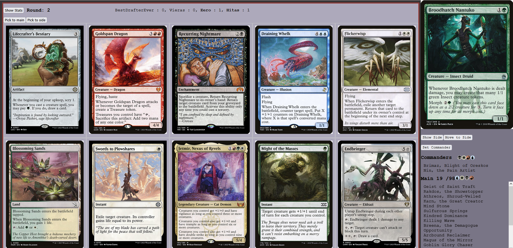

# React Frontend — View Components

## Overview

This document details the view-level components that make up the draft application's user interface. Each view corresponds to a phase of the draft lifecycle and is rendered conditionally by `App.jsx` based on the `mode` state.

---

## Home View

Entry point for users. Handles authentication, draft creation, and lobby discovery.

### Home.jsx — Container Component

Routes to sub-views based on `homeMode` state. Displays contextual wizard images:

| homeMode | Wizard Image | Description |
|----------|--------------|-------------|
| Login | `velho1_whoGoes.png` | Questioning wizard |
| Menu | `velho2_henlo.png` | Welcoming wizard |
| Create | `velho3_makeTheDraftYouSay.png` | Curious wizard |
| Join (has drafts) | `velho5_enticingStuff.png` | Excited wizard |
| Join (no drafts) | `velho4_sad.png` | Disappointed wizard |

### HomeModes.jsx — Sub-Views

#### Login

Initial screen for entering username.

**Components:**
- Text input form (max 16 chars, alphanumeric only)
- Submit button

**Flow:**
1. User enters name
2. On submit: sets username state, sends `Login` message, transitions to Menu

#### Menu

Main navigation after login.

**Options:**
- **Create draft** → Transitions to Create view
- **Join draft** → Sends `Get Lobbies` message, transitions to Join view
- **Go Back** → Clears username, returns to Login

#### CreateDraft

Draft configuration form for the host.

**Configuration Options:**

| Parameter | Default | Range | Description |
|-----------|---------|-------|-------------|
| Number of players | 1 | 0-10 | Target player count |
| Number of rounds | 8 | 0-10 | Draft rounds |
| Ratio of multicolor pool | 3 | 0-10 | Cards from multicolor pool per structured pack |
| Ratio of generic pool | 2 | 0-10 | Cards from each monocolor pool |
| Ratio of colorless pool | 3 | 0-10 | Cards from colorless pool |
| Ratio of land pool | 2 | 0-10 | Cards from land pool |
| Commander pack included | false | — | Include 5-card commander packs |

**Flow:**
1. User configures parameters
2. On submit:
   - Sets owner flag to "T"
   - Generates 4-character random token
   - Sends `Create Lobby` message via `setupDraft()`
   - Sets mode to "Waiting"

#### JoinDraft

Lists available lobbies for joining.

**Display:**
- Table with columns: Token, Players, Max Players, Action
- Join button (disabled if lobby full)
- Empty state message if no drafts available

**Flow:**
1. Displays drafts from state (filtered for player count > 0)
2. On join click:
   - Sends `Join Lobby` message
   - Sets token state
   - Transitions to Lobby mode

---

## Lobby View

Waiting room between draft creation/joining and draft start.

### Lobby.jsx — Container Component

Routes to sub-views based on `lobbyMode`:

| lobbyMode | Component | Trigger |
|-----------|-----------|---------|
| `LobbySuccess` | `<LobbySuccess />` | Successfully joined lobby |
| `LobbyFull` | `<LobbyFailed />` | Attempted to join full lobby |
| `DraftStarted` | `<DraftStarted />` | Attempted to join started draft |
| `LobbyFailed` | `<LobbyFailed />` | Other join failures |

### LobbyModes.jsx — Sub-Views

#### LobbySuccess

Main lobby view for waiting players.

**Owner View (owner === "T"):**
- Draft token display
- Player count: `{current} / {max}`
- "Add NPC" button (always visible when not full)
- "Remove NPC" button (visible only if NPCs present)
- Player list
- "Start Draft" button (visible when lobby full)

**Non-Owner View:**
- Draft token display
- Player list

**NPC Management:**
```javascript
const addNPC = () => {
  sendMessage(connection, { type: "Add NPC", token })
}
const removeNPC = () => {
  sendMessage(connection, { type: "Remove NPC", token })
}
```

#### LobbyFailed / LobbyFull / DraftStarted

Error states with "Go Back" button returning to Home.

---

## Draft View

Active drafting interface. The most complex view, handling pack display, card selection, and deckbuilding preview.

### Draft.jsx — Main Component

Manages three distinct sub-views:
1. **Pack View** — Active pack for picking
2. **Waiting View** — No pack available, waiting for others
3. **Deckbuilder View** — Stats and card organization

#### State Management

**Local State:**
| State | Purpose |
|-------|---------|
| `pick` | Currently selected card ID for picking |
| `statsButton` | Whether to show deckbuilder toggle (requires 5+ cards) |

**Effects:**
- Requests seat token if missing on mount
- Updates `statsButton` when deck size changes
- Recalculates mana curve when deck changes

#### Pack View

Displayed when `pack.length > 0` and `showDeckbuilder === false`.

**Layout:**



**Card Grid:**
- 5 cards per row
- Click to select (highlights with CSS)
- Uses `<Image>` component for flip support

**Pick Buttons:**

Normal case (not Canal Dredger or pack has >1 card):
- "Pick to main" → `confirmPick("main")`
- "Pick to side" → `confirmPick("side")`

Canal Dredger case (holder receives last cards, pack has 1 card):
- "Give" → `giveAway()` — sends card to Dredger holder

```javascript
const confirmPick = (target) => {
  if (pick) {
    sendMessage(connection, {
      type: "Pick",
      card: pick,
      zone: target,
      token
    })
    setPick(0)
    setPack([])
  }
}

const giveAway = () => {
  if (pick) {
    sendMessage(connection, {
      type: "Give Last Card",
      card: pick,
      token
    })
    setPick(0)
    setPack([])
  }
}
```

#### Waiting View

Displayed when `pack.length === 0` and `showDeckbuilder === false`.

**Layout:**


**Wizard Selection:**
Random wizard displayed based on `wizardSelection` (1-3):

| Selection | Image | Text |
|-----------|-------|------|
| 1 | `velho_waiting_angry.png` | "HOW CAN THIS TAKE SO LONG?!" |
| 2 | `velho_waiting_sigh.png` | "Someone is taking their time..." |
| 3 | `velho_waiting_yawn.png` | "Zzzzz..." |

#### Deckbuilder View

Displayed when `showDeckbuilder === true`.

Renders `<DeckBuilder>` component with full filtering and curve visualization. See DeckBuilder section below.

#### DraftNavbar

Top navigation bar during draft.

**Elements:**
- Toggle button: "Show Stats" ↔ "Show Draft"
- Round indicator: "Round: {n}" (or "Commander" for round 0)
- Queue display: comma-separated player names with pack counts
  - **Bold name** = player has pack in hand
  - Format: `PlayerA: 2, **PlayerB**: 0, PlayerC: 1`

```javascript
const queueDisplay = queues.map((queue, index) => (
  <React.Fragment key={queue.username}>
    {queue.hand === 1 ? <strong>{queue.username}</strong> : queue.username} : {queue.queue}
    {index < queues.length - 1 && ", "}
  </React.Fragment>
))
```

---

## PostDraft View

Deckbuilding interface after draft completion. Similar to Draft's deckbuilder view but with additional export functionality.

### PostDraft.jsx — Main Component

**Layout:**


#### PostDraftNavBar

**Elements:**

**Left Section:**
- "Copy Deck to Clipboard" button
- (Owner only) "Validate draft data" button
- (Owner only) "Ignore draft data" button

**Land Section:**
- Basic land counters for W, U, B, R, G, C
- Each with mana symbol, count display, +/- buttons
- Range: 0-99

**Clipboard Export:**
Generates Cockatrice-compatible deck list:
```
1 Commander Name
1 Commander Name (if 2)
1 Card Name
1 Card Name
...
N Plains
N Island
...

1 Sideboard Card
1 Sideboard Card
...
```

Handles clipboard API unavailability with popup fallback.

**Draft Data Decision:**
Owner can validate or ignore draft data for statistics:
```javascript
const handleDataDecision = (value) => {
  setDraftDataDecision(false)
  sendMessage(connection, { type: "Draft Data Decision", token, decision: value })
}
```

---

## Shared Components

### SideBar

Persistent sidebar present in Draft and PostDraft views.

**Structure:**
```
┌──────────────────┐
│   [Card Image]   │  ← Last clicked card preview
├──────────────────┤
│ [Show Side/Main] │
│ [Move to ...]    │
│ [Set Commander]  │
├──────────────────┤
│ Commanders  W U  │  ← Color identity symbols
│ • Commander 1    │
│ • Commander 2    │
├──────────────────┤
│ Main 45/98  W U B│  ← Count includes basic lands
│ • Card 1         │
│ • Card 2         │
│ • Card 3         │
│ ...              │  ← Scrollable
└──────────────────┘
```

**Card Selection:**
- Click card in list → adds to `selectedCards`
- Click again → removes from selection
- Clicking commander → sets `selectedCommanders`
- Selection is mutually exclusive (cards vs commanders)

**Commander Management:**

*Set Commander:*
```javascript
const appointCommander = () => {
  // Validations:
  // - Card selected
  // - Max 2 commanders not exceeded
  // - Single card selected
  // - Is Legendary Creature OR has "can be your commander"
  // - Partner rule: both ≤2 colors, neither is God
  
  sendMessage(connection, {
    type: "Set Commander",
    token,
    card: selectedCards[0].id
  })
}
```

*Remove Commander:*
```javascript
const removeCommander = () => {
  const target = showMain ? "main" : "side"
  sendMessage(connection, {
    type: "Remove Commander",
    card: selectedCommanders[0].id,
    zone: target
  })
}
```

**Card Movement:**
```javascript
const moveCards = () => {
  sendMessage(connection, {
    type: "Move Cards",
    cards: selectedCards,
    to: showMain ? "side" : "main",
    from: showMain ? "main" : "side",
    token
  })
  setSelectedCards([])
}
```

### DeckBuilder

Card display grid with filtering and mana curve visualization. Used in both Draft (stats view) and PostDraft.

**Layout:**


**Props:**
| Prop | Purpose |
|------|---------|
| `main`, `side`, `commanders` | Card arrays |
| `showMain` | Which zone to display |
| `selectedCards`, `selectCards` | Selection state and handler |
| `cardsToDisplay`, `setCardsToDisplay` | Filtered card list |
| `typeFilter`, `setTypeFilter` | Active type filters |
| `colorFilterPos`, `colorFilterNeg` | Color inclusion/exclusion |
| `curveOfMain`, `curveOfDisplayed` | Mana curve data |
| `maxManaValue` | Chart scale |
| `showDeckbuilder` | Triggers re-filter on toggle |

#### Color Filtering

Three-state toggle for each color (W, U, B, R, G, C):

| State | CSS Class | Behavior |
|-------|-----------|----------|
| Neutral | `colorNeutral` | No filtering on this color |
| Included | `colorIncluded` | Show only cards containing this color |
| Excluded | `colorExcluded` | Hide cards containing this color |

**Click Cycle:** Neutral → Included → Excluded → Neutral

```javascript
const handleManaFilter = (color) => {
  if (!colorFilterPos.includes(color) && !colorFilterNeg.includes(color)) {
    setColorFilterPos(colorFilterPos.concat(color))      // Neutral → Included
  } else if (colorFilterPos.includes(color)) {
    setColorFilterPos(colorFilterPos.filter(c => c !== color))
    setColorFilterNeg(colorFilterNeg.concat(color))      // Included → Excluded
  } else if (colorFilterNeg.includes(color)) {
    setColorFilterNeg(colorFilterNeg.filter(c => c !== color))  // Excluded → Neutral
  }
}
```

#### Type Filtering

Clickable type categories showing `{inDeck}/{inPool}` counts:

| Filter | Type | Criteria | Description |
|--------|------|----------|-------------|
| Creatures | Pos | `["Creature"]` | Cards with Creature type |
| Non-Creatures | Neg | `["Creature", "Land", "Conspiracy"]` | Exclude these types |
| Legendaries | Pos | `["Legendary"]` | Legendary supertype |
| Planeswalkers | Pos | `["Planeswalker"]` | Planeswalker type |
| Artifacts | Pos | `["Artifact"]` | Artifact type |
| Enchantments | Pos | `["Enchantment"]` | Enchantment type |
| Instants | Pos | `["Instant"]` | Instant type |
| Sorceries | Pos | `["Sorcery"]` | Sorcery type |
| Non-Basic Lands | Pos | `["Land"]` | Land type |
| Auras | Pos | `["Aura"]` | Aura subtype |
| Equipment | Pos | `["Equipment"]` | Equipment subtype |
| Sagas | Pos | `["Saga"]` | Saga subtype |
| Historics | Pos | `["Artifact", "Legendary", "Saga"]` | Any of these |
| Permanents | Neg | `["Instant", "Sorcery", "Conspiracy"]` | Exclude non-permanents |
| Conspiracies | Pos | `["Conspiracy"]` | Conspiracy type |

**Filter Logic:**
- `Pos` (positive): Include cards matching ANY of the criteria
- `Neg` (negative): Exclude cards matching ANY of the criteria
- Filters with `0/0` count are hidden
- Click selected filter again to clear

```javascript
// Positive filter: union of matches
function filterCardsPos(cards, criteria) {
  var filtered = []
  for (let i = 1; i < criteria.length; i++) {
    filtered = filtered.concat(cards.filter(card => card.types.includes(criteria[i])))
  }
  return filtered
}

// Negative filter: exclude matches
function filterCardsNeg(cards, criteria) {
  var filtered = [].concat(cards)
  for (let i = 1; i < criteria.length; i++) {
    filtered = filtered.filter(card => !card.types.includes(criteria[i]))
  }
  return filtered
}
```

#### Mana Curve Chart

Displays mana value distribution using MUI X Charts.

**Data Structure:**
```javascript
const dataset = curveOfMain.map((mainCount, index) => ({
  main: mainCount,        // Cards in main deck at this MV
  displayed: curveOfDisplayed[index],  // Filtered cards at this MV
  manavalue: index
}))
```

**Two Display Modes:**
- **Bar Chart** (default): Side-by-side bars for Main vs Displayed
- **Line Chart**: Overlapping lines for trend comparison

Toggle button switches between modes.

**Curve Calculation:**
- Excludes lands from curve (lands have no mana value)
- Includes commanders in main deck curve
- Recalculates on any filter or deck change

```javascript
const mainWithoutLands = main.filter(card => !card.types.includes("Land"))
setCurveOfMain(Array.from(
  { length: maxManaValue + 1 },
  (_, index) => mainWithoutLands.concat(commanders)
    .filter(card => card.mana_value === index).length
))
```

#### Card Grid

Displays filtered cards as full images in a 5-column grid.

**Features:**
- Click to select (adds to `selectedCards`)
- Selected cards highlighted with `styles.selected`
- Supports double-faced cards via `<Image>` component
- Respects `showMain` toggle (main+commanders vs side)

```javascript
{cardsToDisplay
  .filter(card => showMain ? main.includes(card) : side.includes(card))
  .reduce((rows, card, index) => {
    if (index % 5 === 0) rows.push([])
    rows[rows.length - 1].push(/* card cell */)
    return rows
  }, [])
  .map((row, rowIndex) => <tr key={rowIndex}>{row}</tr>)
}
```

#### Filter Application Order

When filters are applied, the effect chain is:

1. Start with `main + commanders` (if showMain) or `side`
2. Apply type filter (Pos or Neg)
3. Apply color inclusion filter (show only matching)
4. Apply color exclusion filter (hide matching)
5. Result stored in `cardsToDisplay`

```javascript
useEffect(() => {
  let temp = showMain ? main.concat(commanders) : side
  
  // Type filter
  if (typeFilter[0] !== "All") {
    typeFilter[0] === "Pos"
      ? temp = filterCardsPos(temp, typeFilter)
      : temp = filterCardsNeg(temp, typeFilter)
  }
  
  // Color inclusion
  if (colorFilterPos.length > 0) {
    temp = temp.filter(card => 
      card.color_identity.split("").some(color => colorFilterPos.includes(color))
    )
  }
  
  // Color exclusion
  if (colorFilterNeg.length > 0) {
    temp = temp.filter(card => 
      !card.color_identity.split("").some(color => colorFilterNeg.includes(color))
    )
  }
  
  setCardsToDisplay(temp)
}, [main, side, commanders, typeFilter, showDeckbuilder, colorFilterPos, colorFilterNeg, showMain])

---

## WaitingRoom View

Simple loading state while awaiting server response.

### WaitingRoom.jsx

**Display:**
- "Waiting for server response" message
- Cancel button → returns to Home

Used during draft setup while Flask API processes the configuration.


```

## Component Hierarchy Summary

```
App
├── Home
│   ├── Login
│   ├── Menu
│   ├── CreateDraft
│   └── JoinDraft
├── Lobby
│   ├── LobbySuccess
│   ├── LobbyFailed
│   ├── LobbyFull
│   └── DraftStarted
├── Draft
│   ├── DraftNavbar
│   ├── SideBar
│   ├── DeckBuilder (when showDeckbuilder)
│   └── Pack Grid (when !showDeckbuilder)
├── PostDraft
│   ├── PostDraftNavBar
│   ├── SideBar
│   └── DeckBuilder
└── WaitingRoom
```

---

## User Flow

```
┌─────────┐     ┌─────────┐     ┌─────────┐     ┌─────────┐     ┌──────────┐
│  Login  │ ──► │  Menu   │ ──► │ Create/ │ ──► │  Lobby  │ ──► │  Draft   │
│         │     │         │     │  Join   │     │         │     │          │
└─────────┘     └─────────┘     └─────────┘     └─────────┘     └──────────┘
                    │                               │                 │
                    │ (logout)                      │ (error)         │ (complete)
                    ▼                               ▼                 ▼
               ┌─────────┐                    ┌─────────┐      ┌──────────┐
               │  Login  │                    │  Home   │      │ PostDraft│
               └─────────┘                    └─────────┘      └──────────┘
```

---

## Notes

- Wizard images are loaded from `/public/wizards/` directory
- All card images are fetched from Scryfall CDN
- Mana symbols use Scryfall's SVG endpoint
- CSS modules are used for component-scoped styling
- Each view handles its own sub-routing via conditional rendering
- Commander validation follows custom house rules (partner for ≤2 color non-Gods)