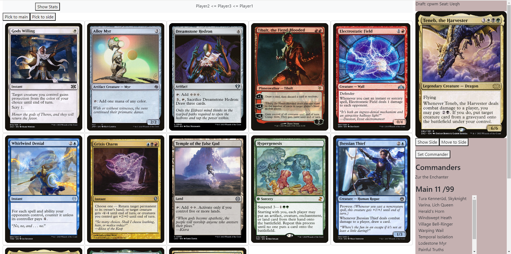
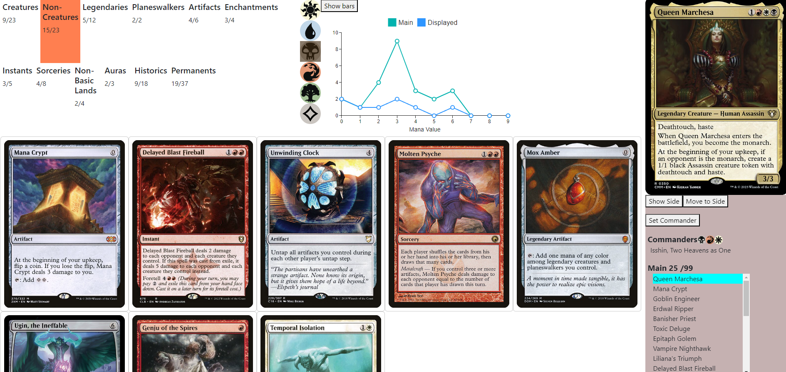
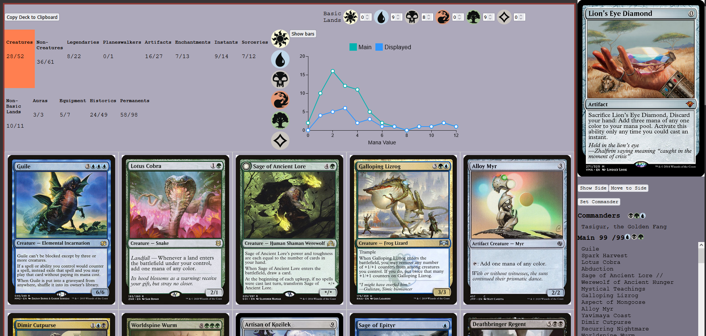

# CubeDraftSimulator

## About

### The important bit:
Thanks to [Samuli Tuomainen](https://samulituomainen.wixsite.com/portfolio) for the wizards and for the help designing the draft app. 

### The Problem

Playing our MTG Commander Cube is one of my favorite things, but setting up the draft takes hours. The drafting itself can take another four, and then everyone still has to build their decks. If we're lucky, we get to play a single round before the day is over.

Another challenge is managing our 2000+ card cube. Refining it is cumbersome, and making cuts — despite being beneficial for the cube's health — is difficult.

### The Solution

A web app that:
- Reduces draft setup from hours to seconds
- Allows remote drafting, so game day is only about playing
- Collects draft data to identify underperforming cards

## Current Status

Version 1.2.0 is live. [The analytics page](https://cubestats.azurewebsites.net/) is also available.

## Features

**Draft Setup**
- Configurable pack composition (multicolor, monocolor, colorless, lands)
- Optional commander packs at the start
- Automatic pack generation and seat assignment

**Drafting**
- Real-time synchronization between players
- Pack queue visualization
- AI-powered NPC drafters for solo or incomplete pods

**Deckbuilding**
- Color and type filtering
- Mana curve visualization (bar/line charts)
- Commander selection with partner rule validation

**Post-Draft**
- Basic land management
- One-click deck export (Cockatrice format)
- Draft data collection for analytics

## Screenshots

### Draft View

Pack selection interface with queue status and deckbuilder toggle.

### Deckbuilder View

Card filtering by color and type, with mana curve visualization.

### Post-Draft View

Final deck assembly with basic lands and clipboard export.

## Roadmap

- **Configurable commander rules** — Support for different house rules around partner/commander legality
- **Custom card tags** — Allow players to create and assign custom tags to cards, enabling personalized filtering in the deckbuilder (similar to the tagging system used by AI drafters)

## Learn More

For technical details about the architecture, components, and data flow, see the [Technical Documentation](./Documentation/TechnicalOverview.md).

## License

Copyright (c) 2025 Eero Antikainen

Permission is hereby granted, free of charge, to any person obtaining
a copy of this software and associated documentation files (the
"Software"), to deal in the Software without restriction, including
without limitation the rights to use, copy, modify, merge, publish,
distribute, sublicense, and/or sell copies of the Software, and to
permit persons to whom the Software is furnished to do so, subject to
the following conditions:

The above copyright notice and this permission notice shall be included
in all copies or substantial portions of the Software.

THE SOFTWARE IS PROVIDED "AS IS", WITHOUT WARRANTY OF ANY KIND,
EXPRESS OR IMPLIED, INCLUDING BUT NOT LIMITED TO THE WARRANTIES OF
MERCHANTABILITY, FITNESS FOR A PARTICULAR PURPOSE AND NONINFRINGEMENT.
IN NO EVENT SHALL THE AUTHORS OR COPYRIGHT HOLDERS BE LIABLE FOR ANY
CLAIM, DAMAGES OR OTHER LIABILITY, WHETHER IN AN ACTION OF CONTRACT,
TORT OR OTHERWISE, ARISING FROM, OUT OF OR IN CONNECTION WITH THE
SOFTWARE OR THE USE OR OTHER DEALINGS IN THE SOFTWARE.
