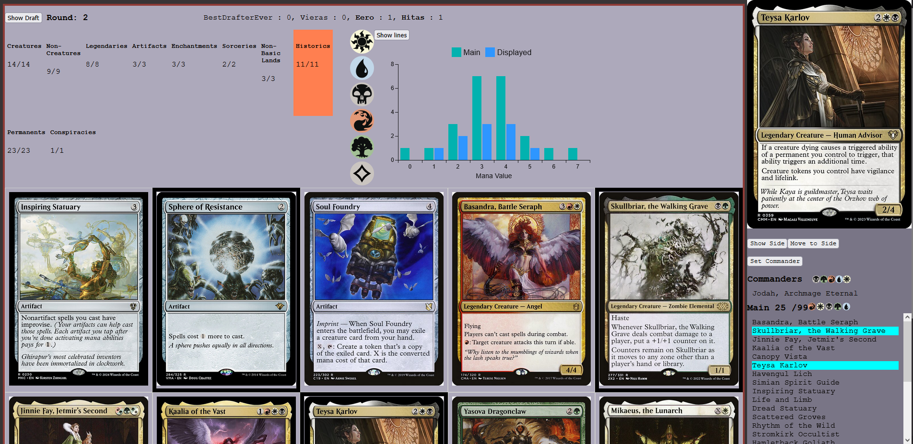

# CubeDraftSimulator
<!--  -->
## About

### The important bit:
Thanks to [Samuli Tuomainen](https://samulituomainen.wixsite.com/portfolio) for the wizards and for the help designing the draft app. 

### Problems

Playing our MTG Commander Cube is one of my favorite things, but setting up the draft takes hours. The drafting itself can take another four, and then everyone still has to build their decks. If we're lucky, we get to play a single round before the day is over.

Another challenge is managing our 2000+ card cube. Refining it is cumbersome, and making cuts — despite being beneficial for the cube's health — is difficult.

### Solution

A web app solves these problems by:
 - Reducing draft setup from hours of tedious and error-prone card handling to just a few seconds (or maybe a little more).
 - Allowing everyone to draft remotely, so game day is only about playing.
 - Collecting draft data to identify cards that consistently go unpicked, making it easier to refine the cube — even if I’m personally attached to some of them.

## Current Status

1.1.0 of the draft app is functional and [the analytics page](https://cubestats-app.azurewebsites.net/) is live now. I will be going over the documentation as a whole soonish.  

I've also built a text-based interface for managing the cubes content. And scripts to update the analytics data after new drafts.

### Setting up a draft

The user can configure the ratios of different draft pools and choose whether to include smaller commander packs at the start of the draft. 

The default ratios for the regular 15 card packs we've used so far:
 - 3 cards from multicolored card pool
 - 2 cards from each of the single colored pools
 - 3 from colorless and
 - 2 from lands

After submitting the desired setup, the Flask API checks whether the setup is valid.
It calculates the number of structured packs by rounding up the result of the formula:
(15 cards per pack × rounds × number of players) / sum of the pool ratios

For n players, the setup requires 5n commander cards. These are drawn from the multicolored pool before any other cards are selected. Each remaining pool must contain enough cards to supply their respective shares to the structured packs. If any requirement isn't met, the setup is canceled and the user is notified. If all checks pass, the setup proceeds.

Commander packs are created and removed from the multicolored pool.
Cards are then drawn according to the ratios and used to assemble structured packs, which are shuffled and trimmed to exactly 15 cards each.
Any leftover (cut) cards are used to form additional randomized 15-card packs.

The final pool of packs is shuffled and assigned to seats using randomized seat tokens, and the draft table is initialized.

The completed setup is then sent to the Node.js server.

### The drafting phase

Once all seats are occupied, the draft can begin. The Node.js server tracks the draft state and broadcasts updates to all players. During the draft, players pick cards from packs and assign them to either their main deck or sideboard.

The top navbar shows the player's queue of incoming packs and indicates which players are currently picking. A bolded username means that player has a pack in hand. From the navbar, players can also switch to the Deckbuilding view.

In the Deckbuilding view, picked cards are displayed as full card images instead of a text list. Players can filter cards by color or (pseudo-)types, and view the mana value curve of their main deck or filtered selection—either as a bar or line chart.

The post-draft view is very similar to the Deckbuilding view, but without draft-related elements like the pack queue or the option to switch back to the draft. Instead, it includes input fields for adding basic lands and a button to copy the completed deck to the clipboard. The copied deck is formatted for direct use in the Cockatrice platform, making it easy to play the draft virtually if desired.

## Learn More

For more technical details about the architecture, components, and data handling, check out the [technical documentation](./Documentation/TechnicalOverview.md).

## License

Copyright (c) 2025 Eero Antikainen
 
 Permission is hereby granted, free of charge, to any person obtaining
 a copy of this software and associated documentation files (the
 "Software"), to deal in the Software without restriction, including
 without limitation the rights to use, copy, modify, merge, publish,
 distribute, sublicense, and/or sell copies of the Software, and to
 permit persons to whom the Software is furnished to do so, subject to
 the following conditions:
 
 The above copyright notice and this permission notice shall be included
 in all copies or substantial portions of the Software.
 
 THE SOFTWARE IS PROVIDED "AS IS", WITHOUT WARRANTY OF ANY KIND,
 EXPRESS OR IMPLIED, INCLUDING BUT NOT LIMITED TO THE WARRANTIES OF
 MERCHANTABILITY, FITNESS FOR A PARTICULAR PURPOSE AND NONINFRINGEMENT.
 IN NO EVENT SHALL THE AUTHORS OR COPYRIGHT HOLDERS BE LIABLE FOR ANY
 CLAIM, DAMAGES OR OTHER LIABILITY, WHETHER IN AN ACTION OF CONTRACT,
 TORT OR OTHERWISE, ARISING FROM, OUT OF OR IN CONNECTION WITH THE
 SOFTWARE OR THE USE OR OTHER DEALINGS IN THE SOFTWARE.
